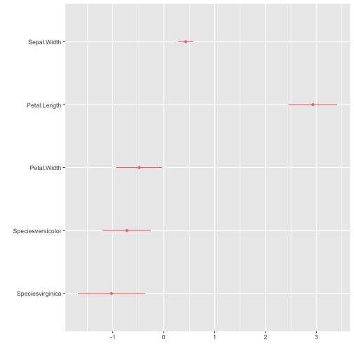

this is a sample notebook
================


This is a sample `Rmd` document, that will generate a `md` document to be pushed to GitHub to document the work that you've done. These notebooks should contain both your code and its outputs, as well as additional comments you'd want to add.   

You can start by loading all necessary packages


```r
library(tidyverse)
library(ggplot2)
library(dotwhisker)
library(here)
```


## Data Exploration

Show both your code and its outputs.  


```r
summary(
  model_fit <- lm(
    Sepal.Length ~.,
    data = iris)
)
```

```
##
## Call:
## lm(formula = Sepal.Length ~ ., data = iris)
##
## Residuals:
##      Min       1Q   Median       3Q      Max
## -0.79424 -0.21874  0.00899  0.20255  0.73103
##
## Coefficients:
##                   Estimate Std. Error t value Pr(>|t|)    
## (Intercept)        2.17127    0.27979   7.760 1.43e-12 ***
## Sepal.Width        0.49589    0.08607   5.761 4.87e-08 ***
## Petal.Length       0.82924    0.06853  12.101  < 2e-16 ***
## Petal.Width       -0.31516    0.15120  -2.084  0.03889 *  
## Speciesversicolor -0.72356    0.24017  -3.013  0.00306 **
## Speciesvirginica  -1.02350    0.33373  -3.067  0.00258 **
## ---
## Signif. codes:  0 '***' 0.001 '**' 0.01 '*' 0.05 '.' 0.1 ' ' 1
##
## Residual standard error: 0.3068 on 144 degrees of freedom
## Multiple R-squared:  0.8673,	Adjusted R-squared:  0.8627
## F-statistic: 188.3 on 5 and 144 DF,  p-value: < 2.2e-16
```

## Data Plotting

You can also embed plots, for example:


```r
dwplot(list(model_fit))
```


