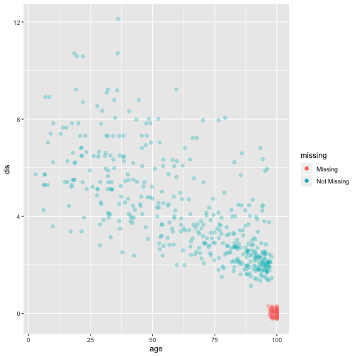
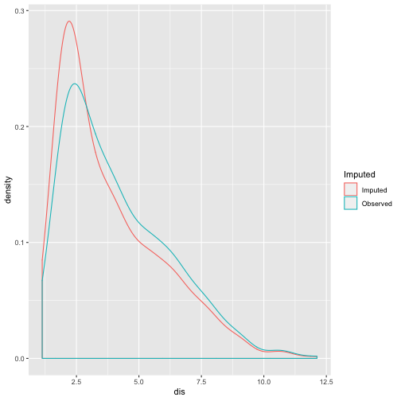
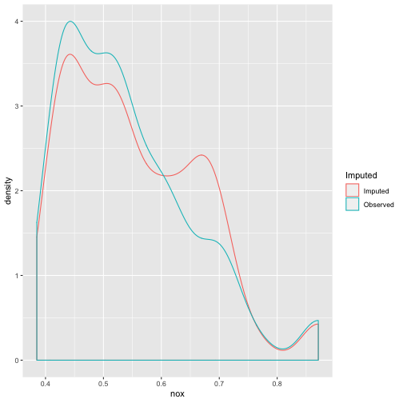
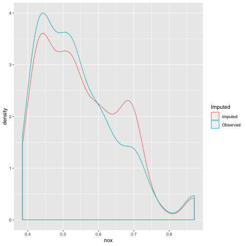

## Missing Data and Imputation


Missing data is one of the most prevalent problems when you're dealing with data, and it can be a particularly problematic one when you're trying to fit models or extract meaningful information from the data. This demonstration will (a) simulate data missingness that is **Missing at Random (MAR)** and (b) illustrate how to address this type of data missingness.

As discussed in class, there's nothing to do when data is **Missing Not at Random (MNAR)** because the probability of missingness is conditional on observed and unobserved data. Data that is **Missing Completely at Random (MCAR)** is imputable because the missingness follows the exact same conditional distributions as the observed data, and that makes it a not very interesting case. But data that is **Missing at Random (MAR)** where the probability of missingness depends *only* on observed data is an interesting and tractable one.

### Missing Data

Let start with a sample dataset, the [Boston Housing dataset](<https://archive.ics.uci.edu/ml/machine-learning-databases/housing/>) in the `mlbench` package. The dataset does not have any missing data. For illustration purposes, we will impose some **MAR** missingness and then apply some imputation techniques to show how well we can recover the original distributions.


```r
# load all packages that will be needed
library(mlbench)
library(Hmisc)
library(mice)
library(missForest)
library(DMwR)
library(ggplot2)
library(naniar)
library(kableExtra)
library(tidyverse)
```

#### Simulate Missingness

As you can see, the `BostonHousing` dataset has no missingness.


```r
data("BostonHousing")
# Check for missing values
sum(is.na.data.frame(BostonHousing)) # No missingness
```

```
## [1] 0
```

```r
# Keep the original data
MAR_BostonHousing <- BostonHousing
```

Now, we can proceed to create some data missingness that is conditional on observed values in the same dataset for a couple of variables.


```r
# A function for MAR
MAR_fun <- function(var1, var2, prop){
  # introduce random noise
  set.seed(9348)
  noise <- var1 + rnorm(length(var1), 0, 0.5)
  # pattern of missingness
  pattern <- rep(0, length(var1))
  # Set a cut-off value
  cutoff <- quantile(noise, prop)
  pattern[noise < cutoff ] <- 1  # 1 observed, 0 missing
  var2[pattern==0] <-NA
  return(var2)
}
```


First, we impose missingness on `dis` (weighted distances to five Boston employment centres) conditional on `age` (proportion of owner-occupied units built prior to 1940)


```r
MAR_BostonHousing$dis <- MAR_fun(MAR_BostonHousing$age, MAR_BostonHousing$dis, 0.85)

# plot missingness
ggplot(MAR_BostonHousing, aes(x= age, y= dis))+
  geom_miss_point(alpha=0.3, size=2)
```




Then, we impose missingness on `nox` (nitric oxides concentration) conditional on `tax` (full-value property-tax rate per $10,000)


```r
MAR_BostonHousing$nox <- MAR_fun(MAR_BostonHousing$tax, MAR_BostonHousing$nox, 0.90)

# plot missingness
ggplot(MAR_BostonHousing, aes(x= tax, y= nox))+
  geom_miss_point(alpha=0.3, size=2)
```


### Missing Data Imputation

This is not usually the case, but we know that missingess only depends on observed values in the dataset, so **MAR** is the appropriate assumption. In real cases, it is mostly an assumption based on some theoretical elaboration based on expert knowledge about the dataset.

Since we know we can use information in the dataset to "complete" our dataset, we can illustrate some common techniques to do it.


#### Mean Imputation

It is rather common that people spend little time thinking about the most appropriate imputation method to use. It is not unusual that missing values are imputed with the mean value for that variable. It is very common because it will not alter the mean value of the variable. It is probably not a very good alternative because, depending on the missingness in this variable, it will tend to shrink variability towards the mean. It is also possible that a better imputation (possible different from an unconditional mean) can be achieved with methods that take more information into consideration to produce plausible values for this variable.


```r
mean_MAR_BH <- MAR_BostonHousing
mean_MAR_BH$dis <- impute(MAR_BostonHousing$dis, mean)  # replace missing values with mean
mean_MAR_BH$nox <- impute(MAR_BostonHousing$nox, mean)  # replace missing values with mean
```


#### Multiple Imputation with Chained Equations (MICE)

A more robust alternative that takes more information into consideration is one done through chained equations. This is an iterative process that starts by assigning start values to all missing data, then picks a variable and uses all other variables to predict its missing values and interates until the imputations converge to a joint distribution. The chained equations approach is flexible because it allows for different predictors and models to be used for different variables.

In addition, multiple imputation produces `m < 1` datasets that preserve the original data but contain plausible values for each missing value from the predictive posterior distribution. This characteristic alone, incorporates our uncertainty about the missing values and can allow us to estimate variances more appropriately.


```r
mice_MAR_BH <- MAR_BostonHousing[, ! names(MAR_BostonHousing) %in% "medv", drop = F]
md.pattern(mice_MAR_BH)
```


```
##     crim zn indus chas rm age rad tax ptratio b lstat nox dis    
## 404    1  1     1    1  1   1   1   1       1 1     1   1   1   0
## 51     1  1     1    1  1   1   1   1       1 1     1   1   0   1
## 26     1  1     1    1  1   1   1   1       1 1     1   0   1   1
## 25     1  1     1    1  1   1   1   1       1 1     1   0   0   2
##        0  0     0    0  0   0   0   0       0 0     0  51  76 127
```


We use the `mice` package here. Note from above that `md.pattern()` function returns a table with missingness pattern. From this example, we learn that there are 404 observations with no missing values. 51 observations have missingness in `dis`, 26 observations have missingness on `nox`, and 25 observations have missing values both in `dis` and `nox`.

Let's impute the missing values in this dataset using **MICE**. Note that in this example, we've set mice to use all variables to impute all missing data, and set a linear regression (`method = "norm`) as the model to fit to impute the missing values.


```r
# define parameters for multiple imputation

mi_mod <-mice(mice_MAR_BH,
              m = 5,
              maxit = 100,
              method = "norm",
              print = FALSE)

# because we set m = 5 above, we have 5 imputed datasets that should be used
# to obtain the appropriate information from the multiply imputed data

summary(mi_mod)
```

```
## Class: mids
## Number of multiple imputations:  5 
## Imputation methods:
##    crim      zn   indus    chas     nox      rm     age     dis     rad 
##      ""      ""      ""      ""  "norm"      ""      ""  "norm"      "" 
##     tax ptratio       b   lstat 
##      ""      ""      ""      "" 
## PredictorMatrix:
##       crim zn indus chas nox rm age dis rad tax ptratio b lstat
## crim     0  1     1    1   1  1   1   1   1   1       1 1     1
## zn       1  0     1    1   1  1   1   1   1   1       1 1     1
## indus    1  1     0    1   1  1   1   1   1   1       1 1     1
## chas     1  1     1    0   1  1   1   1   1   1       1 1     1
## nox      1  1     1    1   0  1   1   1   1   1       1 1     1
## rm       1  1     1    1   1  0   1   1   1   1       1 1     1
```

```r
# extracts the second imputed dataset, if we wanted a single dataset to impute
comp_data <- mice::complete(mi_mod, 2)
```


Monitor Convergence and increase iteration number when necessary an indication of convergence is how well the m parallel chains mix.


```r
# check convergence
plot(mi_mod)
```


It is always a good idea to check the imputations visually. The density plots below compare the density of observed data with imputed data. We would expect them to be similar, because missingness is **MAR**. In this case, you can see that imputations for `dis` are relatively close, but those for `nox` are not so good.


```r
# check density plots
densityplot(mi_mod)
```


#### KNN Imputation

KNN can be used for missing data imputation. It is close in spirit to "hot deck" or "cold deck" imputation where the closest value - under some metric - is assigned as an imputed missing value. Its application is straightfoward under the `DMwR` package.


```r
knn_MAR_BH <- knnImputation(MAR_BostonHousing[, !names(MAR_BostonHousing) %in% "medv"])  
sum(is.na(knn_MAR_BH))
```

```
## [1] 0
```

Check the density plots for knn

```r
combine_data<- function(imputed_data, observed_data){
  imp <- cbind(imputed_data, Imputed = rep("Imputed",dim(imputed_data)[1]))
  orig <- cbind(observed_data,  Imputed = rep("Observed",dim(imputed_data)[1]))
  rbind(imp, orig)
}

ggplot(combine_data(knn_MAR_BH, MAR_BostonHousing[-14]), aes(x = dis, colour = Imputed)) +
  geom_density() 
```



```r
ggplot(combine_data(knn_MAR_BH, MAR_BostonHousing[-14]), aes(x = nox, colour = Imputed)) +
  geom_density() 
```




#### Random Forest Imputation

Another imputation method that can handle non-linearities and deep interactions between variables, that may help get better recover the original distribution under **MAR** is Random Forests. Its application is straightforward under the `missForest` package.


```r
rf_MAR<- missForest(MAR_BostonHousing, maxiter = 50)
```

```
##   missForest iteration 1 in progress...done!
##   missForest iteration 2 in progress...done!
##   missForest iteration 3 in progress...done!
```

```r
#get the imputed data
rf_MAR_BH <- rf_MAR$ximp
```

Check the density plots for Random Forest


```r
ggplot(combine_data(rf_MAR_BH, MAR_BostonHousing), aes(x = dis, colour = Imputed)) +
  geom_density() 
```


```r
ggplot(combine_data(rf_MAR_BH, MAR_BostonHousing), aes(x = nox, colour = Imputed)) +
  geom_density() 
```




### An assessment

It is not typically the case that we would have means to assess how good an imputation is. In this example, we can actually get a sense of how good each method was for recovering the original values.

Please note that these assessments are applicable to this example, and are not a comment on which method is generally better than others.  


```r
# :::::::::::::::::::::::::::::::::::::::::::::::::::::::::::::::::::::::::::::
# ::::::::: GET IMPUTATION METRICS FOR ALL METHODS ::::::::::::::::::::::::::::

# ::::::::: MEAN IMPUTATOON METRICS

# Get an accuracy metric for the imputation of dis
real_values <- BostonHousing$dis[is.na(MAR_BostonHousing$dis)]
imputed_values <- mean_MAR_BH$dis[is.na(MAR_BostonHousing$dis)]
ac_mean_dis <- regr.eval(real_values,imputed_values)

# Get an accuracy metric for the imputation  of nox
real_values <- BostonHousing$nox[is.na(MAR_BostonHousing$nox)]
imputed_values <- mean_MAR_BH$nox[is.na(MAR_BostonHousing$nox)]
ac_mean_nox <- regr.eval(real_values,imputed_values)

# ::::::::: MICE METRICS

# calculate accuracy for multiple datasets, we should pool them
accuracy <- function(real_data, mi_mod, var = "x") {
  mis_indx <- is.na(mice::complete(mi_mod, 0))[, var]
  acc <- matrix(NA, mi_mod$m, 4)
  for (i in seq_len(mi_mod$m)) {
    imputed_values<- mice::complete(mi_mod, i)[mis_indx, var]
    real <- real_data[mis_indx, var]
    acc [i, ] <- unname(regr.eval(real, imputed_values))
  }
  colMeans(acc)
}

ac_mi_dis <- accuracy(BostonHousing, mi_mod, var="dis")
ac_mi_nox <- accuracy(BostonHousing, mi_mod, var="nox")

# ::::::::: KNN IMPUTATION METRICS

## get the accuracy of dis
real_values <- BostonHousing$dis[is.na(MAR_BostonHousing$dis)]
imputed_values <- knn_MAR_BH[is.na(MAR_BostonHousing$dis), "dis"]
ac_knn_dis <- regr.eval(real_values,imputed_values)

#Get the accuracy of nox
real_values <- BostonHousing$nox[is.na(MAR_BostonHousing$nox)]
imputed_values <- knn_MAR_BH[is.na(MAR_BostonHousing$nox), "nox"]
ac_knn_nox <- regr.eval(real_values,imputed_values)

# ::::::::: RANDOM FORESTS IMPUTATION METRICS

##Get the accuracy of dis
real_values <- BostonHousing$dis[is.na(MAR_BostonHousing$dis)]
imputed_values <- rf_MAR_BH[is.na(MAR_BostonHousing$dis), "dis"]
ac_rf_dis <- regr.eval(real_values,imputed_values)

#Get the accuracy of nox
real_values <- BostonHousing$nox[is.na(MAR_BostonHousing$nox)]
imputed_values <- rf_MAR_BH[is.na(MAR_BostonHousing$nox), "nox"]
ac_rf_nox <- regr.eval(real_values,imputed_values)
```

Note that on this example, the best performing model to recover the original values was Random Forests imputation.


```r
result_dis <- data.frame(rbind(ac_mean_dis, ac_mi_dis, ac_knn_dis,ac_rf_dis))
result_nox <-  data.frame(rbind(ac_mean_nox, ac_mi_nox, ac_knn_nox,ac_rf_nox))

names=c("mean", "mi", "knn", "rf")
row.names(result_dis) <- names
row.names(result_nox) <- names

# `dis` imputation accuracy
kable(
  result_dis, 
  format = "markdown"
  ) 
```


|     |       mae|       mse|      rmse|      mape|
|:----|---------:|---------:|---------:|---------:|
|mean | 2.3096752| 5.6935216| 2.3861101| 1.4301387|
|mi   | 1.0723415| 1.7645498| 1.3242190| 0.6319003|
|knn  | 0.3491321| 0.1928595| 0.4391577| 0.2211451|
|rf   | 0.2827456| 0.1074540| 0.3278018| 0.1811846|

```r
# `nox` imputation accuracy
kable(
  result_nox, 
  format = "markdown"
  ) 
```


|     |       mae|       mse|      rmse|      mape|
|:----|---------:|---------:|---------:|---------:|
|mean | 0.1284307| 0.0204837| 0.1431213| 0.1841139|
|mi   | 0.0678637| 0.0073682| 0.0857348| 0.1038391|
|knn  | 0.0466706| 0.0031649| 0.0562575| 0.0721173|
|rf   | 0.0394476| 0.0025407| 0.0504058| 0.0606687|
