## Three Algorithms in your toolbox


### Algorithm I: OLS (the inferential lane)

We want to start understanding something about the dynamics in the `organized_crime_dead` variable. We run a simple model "controlling" for variables that may have an influence on the **data generating process**.


```r
summary(
  lm(organized_crime_dead ~ organized_crime_wounded +
       afi + army + navy + federal_police +
       long_guns_seized+ small_arms_seized +
       clips_seized + cartridge_sezied,
     data = AllData)
  )
```

```
##
## Call:
## lm(formula = organized_crime_dead ~ organized_crime_wounded +
##     afi + army + navy + federal_police + long_guns_seized + small_arms_seized +
##     clips_seized + cartridge_sezied, data = AllData)
##
## Residuals:
##      Min       1Q   Median       3Q      Max
## -11.6058  -0.7274  -0.4506   0.2192  27.3262
##
## Coefficients:
##                           Estimate Std. Error t value Pr(>|t|)    
## (Intercept)              0.4505553  0.0332307  13.558  < 2e-16 ***
## organized_crime_wounded  0.3736900  0.0239171  15.624  < 2e-16 ***
## afi                     -0.2261752  0.4210396  -0.537   0.5912    
## army                     0.3066898  0.0532594   5.758 8.96e-09 ***
## navy                     0.7150402  0.1389449   5.146 2.75e-07 ***
## federal_police          -0.1271515  0.0773309  -1.644   0.1002    
## long_guns_seized         0.1478424  0.0085972  17.197  < 2e-16 ***
## small_arms_seized       -0.0437447  0.0184592  -2.370   0.0178 *  
## clips_seized             0.0004374  0.0003152   1.388   0.1653    
## cartridge_sezied        -0.0001690  0.0000193  -8.760  < 2e-16 ***
## ---
## Signif. codes:  0 '***' 0.001 '**' 0.01 '*' 0.05 '.' 0.1 ' ' 1
##
## Residual standard error: 1.731 on 5386 degrees of freedom
## Multiple R-squared:  0.1413,	Adjusted R-squared:  0.1398
## F-statistic: 98.44 on 9 and 5386 DF,  p-value: < 2.2e-16
```

Some interesting patterns arise:

* conditional on everything else, an increase in one `organized_crime_dead` increases by 1/3 the number of `organized_crime_wounded`
* conditional on everything else, confrontations where the army participates increase by 1/3 the number of `organized_crime_wounded`, and by ~2/3 in events where the navy participates
* conditional on everything else, .15 more people die when long guns were seized

Not quite possible to make any causal claims, for a number of reasons. But we also need to check some additional assumptions to make sure that even these estimates are not biased.

For example, it is entirely possible that these variables are highly correlated and provide very similar information, which migh create problems for estimation and inference.   
A simple correlation plot among all variables in the model could be helpful to assess
structure and facilitate model diagnosis and interpretation.

To create a correlation plot, we need to:

**1.** first define the subset of variables to those variables that we are focusing on


```r
col_vector <- c("organized_crime_dead", "organized_crime_wounded", "afi", "army",
                "navy", "federal_police", "long_guns_seized", "small_arms_seized",
                "clips_seized", "cartridge_sezied")
```

**2.** then create a dataframe that creates the combinations from the correlation matrix


```r
correlations <- AllData %>%
  select_(.dots = col_vector) %>%
  cor(.) %>%
  round(2) %>%
  melt()
```
**3.** and then we graph


```r
ggplot(correlations, aes(x=Var1, y=Var2, fill= value))+
  geom_tile(color = "white") +
  theme_minimal() +
  scale_x_discrete("") +
  scale_y_discrete("") +
  theme(axis.text.x = element_text(angle =30, vjust =1, hjust =1)) +
  scale_fill_gradient2(low = "blue", high = "red", mid = "white",
                       midpoint = 0, limit = c(-1,1), space = "Lab",
                       name="Pearson\nCorrelation")
```

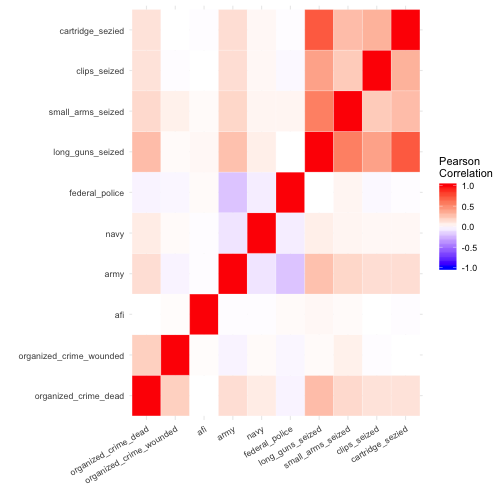

It looks like there's some variables that are highly correlated, but as we would expect: more cartridges are seized where more long guns are seized, but we don't really have linear combinations of variables.

Now, perhaps a quick look at the residuals from the regression


```r
ggplot(AllData, aes(global_id, residuals)) +
  geom_point(alpha = 1/2, size = 3) +
  theme_minimal() +
  scale_x_continuous("event id") +
  scale_y_continuous("residuals") +
  theme(axis.text.y = element_text(size=10),
        axis.text.x = element_text(size=10),
        panel.grid.major.x = element_blank(),
        panel.grid.minor.x = element_blank(),
        panel.grid.minor.y = element_blank())
```

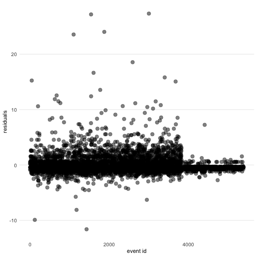


Something odd is going on with the estimation. It seems that there are some consistent
overpredictions. We forgot to look at the distribution of `organized_crime_dead` before
we started. Let's do that now.


```r
ggplot(data = AllData) +
  geom_bar(aes(x=organized_crime_dead), fill = "blue") +
  theme_minimal() +
  scale_x_continuous("", breaks = c(0, 1,2,3,4,5,10,15,20,30),
                     labels = c("0", "1","2","3","4", "5","10","15","20","30")) +
  scale_y_continuous("") +  
  theme(axis.text.y = element_text(size=14),
        axis.text.x = element_text(size=12),
        panel.grid.major.x = element_blank(),
        panel.grid.minor.x = element_blank(),
        panel.grid.minor.y = element_blank()
  )
```

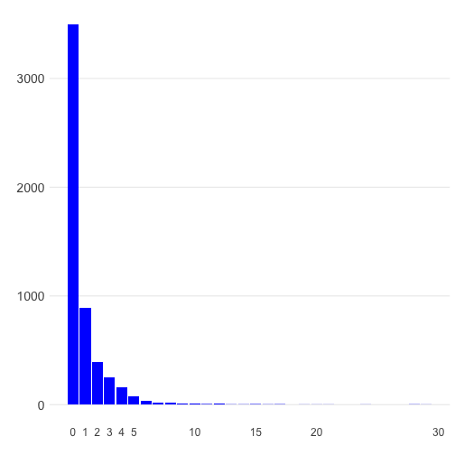


It turns out that `organized_crime_dead` is quite skeweded and has some zero-inflation. That may be causing some problems, including biasing our estimates. But we can always apply the textbook solution: `log(organized_crime_dead)`!


```r
ggplot(data = AllData) +
  geom_bar(aes(x=log(organized_crime_dead+1)), fill = "blue") +
  theme_minimal() +
  scale_x_continuous("", breaks = c(0, 1,2,3,4,5,10,15,20,30),
                     labels = c("0", "1","2","3","4", "5","10","15","20","30")) +
  scale_y_continuous("") +  
  theme(axis.text.y = element_text(size=14),
        axis.text.x = element_text(size=12),
        panel.grid.major.x = element_blank(),
        panel.grid.minor.x = element_blank(),
        panel.grid.minor.y = element_blank()
)
```

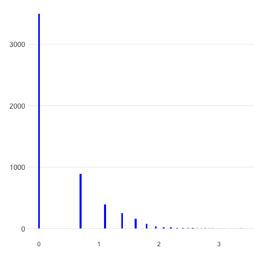


That didn't seem to correct the distribution of `organized_crime_dead`. Perhaps time to change to a more appropriate (zero-inflated count) model?


### Algorithm I: OLS (the predictive lane)

But it's entirely possible that our interest is in predicting `organized_crime_dead`. So we switch gears since the inferential model is quite likely to generate terrible predictions. SO first, we need to refine our model.

A good starting point is selecting a model with less covariates that is better at prediction.

#### Best Subset Selection


```r
newdata <- AllData[, names(AllData) %in% c("organized_crime_wounded", "afi", "army",
                "navy", "federal_police", "long_guns_seized", "small_arms_seized",
                "clips_seized", "cartridge_sezied")]
newdata <- cbind(newdata, organized_crime_dead = AllData$organized_crime_dead)
subset_full <- bestglm(newdata, family = gaussian, IC = 'AIC', method = 'exhaustive', TopModels = 10)
subset_full$BestModels  #Top 10 models with low AIC
```

```
##    organized_crime_wounded long_guns_seized small_arms_seized
## 1                     TRUE             TRUE              TRUE
## 2                     TRUE             TRUE              TRUE
## 3                     TRUE             TRUE              TRUE
## 4                     TRUE             TRUE              TRUE
## 5                     TRUE             TRUE              TRUE
## 6                     TRUE             TRUE              TRUE
## 7                     TRUE             TRUE              TRUE
## 8                     TRUE             TRUE              TRUE
## 9                     TRUE             TRUE             FALSE
## 10                    TRUE             TRUE             FALSE
##    cartridge_sezied clips_seized   afi army federal_police navy Criterion
## 1              TRUE        FALSE FALSE TRUE           TRUE TRUE  5925.552
## 2              TRUE         TRUE FALSE TRUE           TRUE TRUE  5925.604
## 3              TRUE         TRUE FALSE TRUE          FALSE TRUE  5926.345
## 4              TRUE        FALSE FALSE TRUE          FALSE TRUE  5926.368
## 5              TRUE        FALSE  TRUE TRUE           TRUE TRUE  5927.244
## 6              TRUE         TRUE  TRUE TRUE           TRUE TRUE  5927.315
## 7              TRUE         TRUE  TRUE TRUE          FALSE TRUE  5928.023
## 8              TRUE        FALSE  TRUE TRUE          FALSE TRUE  5928.025
## 9              TRUE        FALSE FALSE TRUE           TRUE TRUE  5929.091
## 10             TRUE         TRUE FALSE TRUE           TRUE TRUE  5929.212
```


```r
barplot(subset_full$BestModels[,'Criterion'],
        names.arg=sapply(1:10, toOrdinal),
        xlab = "model ranks", ylab = "AIC",
        ylim = c(5923, 5930), xpd = FALSE,
        main = "AIC of suggested models")
```

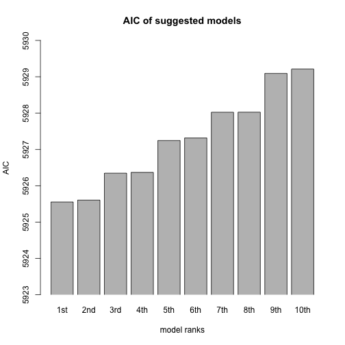

```
##
## Call:
## lm(formula = y ~ ., data = data.frame(Xy[, c(bestset[-1], FALSE),
##     drop = FALSE], y = y))
##
## Coefficients:
##             (Intercept)  organized_crime_wounded         long_guns_seized  
##               0.4498740                0.3730898                0.1500302  
##       small_arms_seized         cartridge_sezied                     army  
##              -0.0434190               -0.0001668                0.3097144  
##          federal_police                     navy  
##              -0.1296465                0.7166220
```


```r
subset_full_bic <- bestglm(newdata, family = gaussian, IC = 'BIC',
                           method = 'exhaustive', TopModels = 10)
subset_full_bic$BestModels  #Top 10 models with low BIC
```

```
##    organized_crime_wounded long_guns_seized small_arms_seized
## 1                     TRUE             TRUE             FALSE
## 2                     TRUE             TRUE              TRUE
## 3                     TRUE             TRUE             FALSE
## 4                     TRUE             TRUE             FALSE
## 5                     TRUE             TRUE             FALSE
## 6                     TRUE             TRUE              TRUE
## 7                     TRUE             TRUE              TRUE
## 8                     TRUE             TRUE              TRUE
## 9                     TRUE             TRUE             FALSE
## 10                    TRUE             TRUE             FALSE
##    cartridge_sezied clips_seized   afi army federal_police navy Criterion
## 1              TRUE        FALSE FALSE TRUE          FALSE TRUE  5963.253
## 2              TRUE        FALSE FALSE TRUE          FALSE TRUE  5965.929
## 3              TRUE        FALSE FALSE TRUE           TRUE TRUE  5968.651
## 4              TRUE         TRUE FALSE TRUE          FALSE TRUE  5969.892
## 5              TRUE        FALSE  TRUE TRUE          FALSE TRUE  5971.519
## 6              TRUE        FALSE FALSE TRUE           TRUE TRUE  5971.706
## 7              TRUE         TRUE FALSE TRUE          FALSE TRUE  5972.499
## 8              TRUE        FALSE  TRUE TRUE          FALSE TRUE  5974.179
## 9              TRUE         TRUE FALSE TRUE           TRUE TRUE  5975.366
## 10             TRUE        FALSE  TRUE TRUE           TRUE TRUE  5976.953
```


```r
barplot(subset_full_bic$BestModels[,'Criterion'],
        names.arg=sapply(1:10, toOrdinal),
        xlab = "model ranks", ylab = "BIC",
        ylim = c(5960, 5980), xpd = FALSE,
        main = "BIC of suggested models")
```

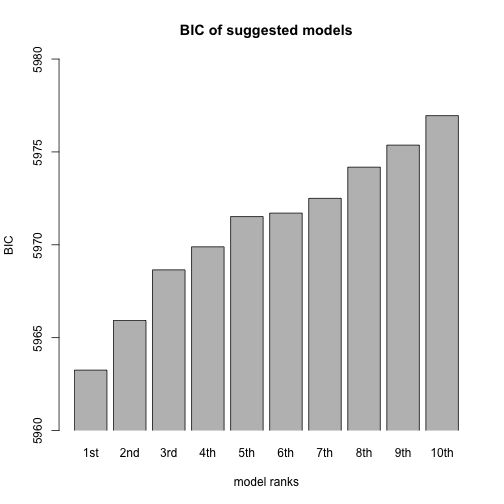


```r
subset_full_bic$BestModel
```

```
##
## Call:
## lm(formula = y ~ ., data = data.frame(Xy[, c(bestset[-1], FALSE),
##     drop = FALSE], y = y))
##
## Coefficients:
##             (Intercept)  organized_crime_wounded         long_guns_seized  
##               0.4237166                0.3713140                0.1389487  
##        cartridge_sezied                     army                     navy  
##              -0.0001567                0.3263833                0.7347481
```

To choose a best model among a set of models, we used AIC and BIC statistic. 7 variable model was suggested with AIC, and 5 variable model was suggested using BIC. Since BIC generally supports more parsimonious results, it was expectd to have less variables in the final model based on BIC.

* 7-variable model based on AIC

```
organized_crime_dead ~ organized_crime_wounded +
                       army + navy + federal_police +
                       long_guns_seized + small_arms_seized + cartridge_sezied
```
* 5-variable model based on BIC

```
organized_crime_dead ~ organized_crime_wounded +
                       army + navy +
                       long_guns_seized + cartridge_sezied
```


#### Forward Selection


```r
# forward selection
forward_subset = regsubsets(organized_crime_dead ~ ., data = newdata,
                            nvmax = 9, method = "forward")
summary_fw <- summary(forward_subset)
which.min(summary_fw$cp)
```

```
## [1] 7
```


```r
plot(summary_fw$cp, xlab = "Number of Variables", ylab = "Cp")
```

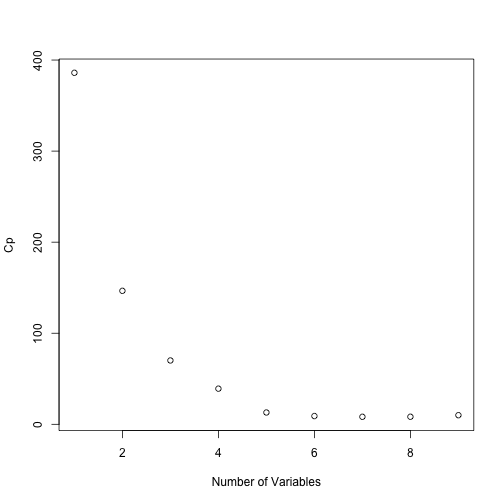

Best subset selection using AIC, and Forward stepwise selection using Mallows' $C_p$ resulted in the same best model with 7 variables.

#### Model Selection with Validation Set


```r
set.seed(12910) #for replicability, always set a seed!
n <- dim(newdata)[1]
ntest <- round(n*0.3) #size of testing data
index <- sample(n,ntest) # indices of testing samples
data_test<- newdata[index,]
data_train <- newdata[-index,]
```


```r
fit = regsubsets(organized_crime_dead ~ ., data = data_train, nvmax = 9, method = "forward")
```


```r
test_error = rep(NA, 9)
test_model = model.matrix(organized_crime_dead ~ ., data = data_test)  
for (i in 1:9) {
    coeff = coef(fit, id = i)
    pred = test_model[, names(coeff)] %*% coeff
    test_error[i] = mean((data_test$organized_crime_dead - pred)^2)
}
plot(sqrt(test_error), ylab = "Root MSE", ylim=c(1.67, 1.91),
     pch = 19, type = "b")
points(sqrt(fit$rss[-1]/3777), col = "blue",
       pch = 19, type = "b")
legend("topright", legend = c("Training", "Validation"),
       col = c("blue", "black"), pch = 19)
```

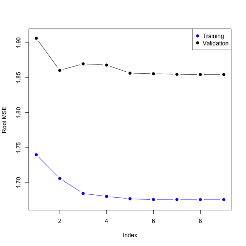

As expected the training error descreases as model complexity increases, but we cannot observe the same pattern for test error. After 5 variable model validation error is somewhat steady, which is the same model as BIC is offered above. To obtain better results we should perform cross validation.

#### Model selection with Cross Validation


```r
set.seed(4837)
forward_subset_cv = bestglm(newdata, family = gaussian,
                            IC = 'CV',
                            CVArgs=list(Method="HTF", K=10, REP=1),
                         method = 'forward')   # 10-Fold Cross Validation
summary(forward_subset_cv$BestModel)
```

```
##
## Call:
## lm(formula = y ~ ., data = data.frame(Xy[, c(bestset[-1], FALSE),
##     drop = FALSE], y = y))
##
## Residuals:
##      Min       1Q   Median       3Q      Max
## -15.4137  -0.6698  -0.6698   0.3302  27.6742
##
## Coefficients:
##                  Estimate Std. Error t value Pr(>|t|)    
## (Intercept)      0.669800   0.025822   25.94   <2e-16 ***
## long_guns_seized 0.109332   0.005091   21.47   <2e-16 ***
## ---
## Signif. codes:  0 '***' 0.001 '**' 0.01 '*' 0.05 '.' 0.1 ' ' 1
##
## Residual standard error: 1.791 on 5394 degrees of freedom
## Multiple R-squared:  0.07876,	Adjusted R-squared:  0.07859
## F-statistic: 461.2 on 1 and 5394 DF,  p-value: < 2.2e-16
```


```r
error_CV <- forward_subset_cv$Subsets[,"CV"]
sd_CV<- forward_subset_cv$Subsets[,"sdCV"]
k <- 0:(length(error_CV)-1)

dat <- as.data.frame(cbind(k, error_CV, sd_CV))
ggplot(dat, aes(x=k, y=error_CV)) +
  geom_errorbar(aes(ymin=error_CV-sd_CV, ymax=error_CV+sd_CV), width=.1, col="blue") +
  geom_line() +
  geom_point()+
  labs(title= "Model selection with 10-fold cross-validation and 1-sd rule",
       x="Subset Size", y= "CV_error")+
  scale_x_discrete(limits=c(0:9))+
  geom_vline(xintercept = oneSDRule(dat[,c("error_CV", "sd_CV")])-1, col="red", linetype="dotted", size=1)
```

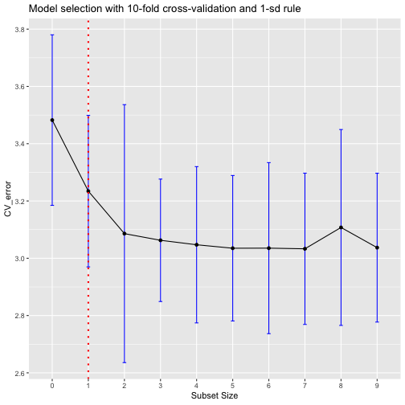


Cross-validation, though, produced a 1-variable model as the best alternative.


### Algorithm II: logistic regression (the inferential lane)

We may need to deal with a different type of question. One very common case is that of binary variables that we need to analyze. From our data, we need to infer something about deaths among members of organized crime. So, we proceed to convert the continuous death variables into a binary indicator `organized_crime_death`.


```r
AllData$organized_crime_death <- ifelse(AllData$organized_crime_dead > 1, 1, 0)
```

We have a good handle now about some relationships between covariates in the data, so we can start by reproducing our previous model, but this time in terms of whether we observe deaths or no deaths in confrontations between organized crime and a armed forces.


```r
logit_model <-
  glm(organized_crime_death ~ organized_crime_wounded +
       afi + army + navy + federal_police +
       long_guns_seized+ small_arms_seized +
       clips_seized + cartridge_sezied,
      family = binomial(link = "logit"),
     data = AllData)
summary(logit_model)
```

```
##
## Call:
## glm(formula = organized_crime_death ~ organized_crime_wounded +
##     afi + army + navy + federal_police + long_guns_seized + small_arms_seized +
##     clips_seized + cartridge_sezied, family = binomial(link = "logit"),
##     data = AllData)
##
## Deviance Residuals:
##     Min       1Q   Median       3Q      Max  
## -4.5396  -0.6657  -0.4731  -0.4592   2.7612  
##
## Coefficients:
##                           Estimate Std. Error z value Pr(>|z|)    
## (Intercept)             -2.1337831  0.0599578 -35.588  < 2e-16 ***
## organized_crime_wounded  0.2839835  0.0376519   7.542 4.62e-14 ***
## afi                     -0.6960636  0.7234004  -0.962    0.336    
## army                     0.7395036  0.0812191   9.105  < 2e-16 ***
## navy                     0.9292565  0.1827726   5.084 3.69e-07 ***
## federal_police          -0.0628413  0.1331772  -0.472    0.637    
## long_guns_seized         0.1544432  0.0141145  10.942  < 2e-16 ***
## small_arms_seized       -0.0137429  0.0271923  -0.505    0.613    
## clips_seized            -0.0004430  0.0004284  -1.034    0.301    
## cartridge_sezied        -0.0002413  0.0000510  -4.730 2.25e-06 ***
## ---
## Signif. codes:  0 '***' 0.001 '**' 0.01 '*' 0.05 '.' 0.1 ' ' 1
##
## (Dispersion parameter for binomial family taken to be 1)
##
##     Null deviance: 5185.2  on 5395  degrees of freedom
## Residual deviance: 4721.3  on 5386  degrees of freedom
## AIC: 4741.3
##
## Number of Fisher Scoring iterations: 4
```

Interestingly, results are directionally similar to those we obtained from the OLS model using the continous count variable `organized_crime_dead`.

Perhaps the most interesting thing for a logistic regression is that its estimates can easily be translated to expected probabilities. Let's see one very interesting case where we would want to see the change in the probability of observing a death or more amongst members of organized crime when we observe no wounded amongst organized crime (`organized_crime_wounded == 0`) and when we observe the maximum amount of wounded (`organized_crime_wounded == 30`).


```r
z_out <- zelig(organized_crime_death ~ organized_crime_wounded +
        afi + army + navy + federal_police +
        long_guns_seized+ small_arms_seized +
        clips_seized + cartridge_sezied,
      model = "logit", data = AllData, cite = FALSE)
x_low  <- setx(z_out, organized_crime_wounded = 0)
x_high <- setx(z_out, organized_crime_wounded = 30)
sim_out <- sim(z_out, x = x_low, x1 = x_high)
summary(sim_out)
```

```
##      Length       Class        Mode
##           1 Zelig-logit          S4
```

```r
plot(sim_out)
```

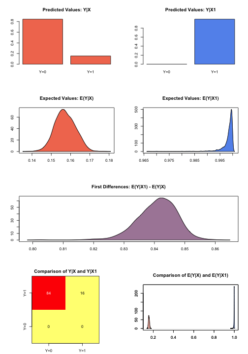

It turns out that holding all other values at their "typical" values, the probability of observing deaths among members of organized crime increases by about 84% when the number of wounded changes from zero to thirty. If this is the correct model, both deaths and wounds seem to move together among members of organized crime.

But we forgot to check the fit of this model. It can be easily done in a sophisticated-but-visual manner with heatmap plots.


```r
pred <- predict(logit_model, type = "response")
heatmap.fit(AllData$organized_crime_death,
            pred,
            reps = 1000,
            color = TRUE)
```

```
##
## Calculating optimal loess bandwith...
## aicc Chosen Span =  0.4662695
##  
## Generating Bootstrap Predictions...
##
  
 |=================================================================| 100%
```

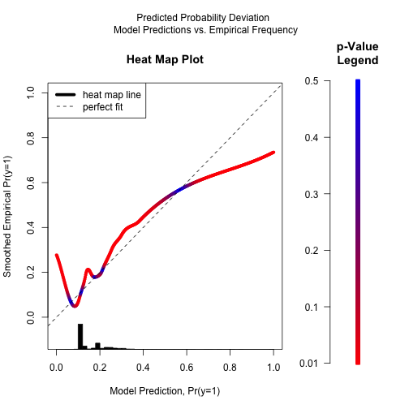

```
##
##  
## *******************************************
## 78.61379% of Observations have one-tailed p-value <= 0.1
## Expected Maximum = 20%
## *******************************************
```

Turns out that our model has a rather poor fit, as indicated by the deviations from the $45^o$ line. Furthermore, the red color indicates that those deviations are due to something more than just random error. There may be a problem in the specification... or in the data itself.

One thing that is easy to forget is that logistic regression assumes that `organized_crime_death` is balanced, in the sense that each category represents about half its values, otherwise estimates may be biased. We never checked for that; let's do that now.


```r
ggplot(data = AllData) +
  geom_bar(aes(x=organized_crime_death,
               y = (..count..)/sum(..count..)), fill = "brown4") +
  scale_y_continuous("", labels = scales::percent) +
  scale_x_continuous("", breaks = c(0, 1),
                     labels = c("no deaths", "deaths")) +
  theme_minimal() +
  theme(axis.text.y = element_text(size=14),
        axis.text.x = element_text(size=12),
        panel.grid.major.x = element_blank(),
        panel.grid.minor.x = element_blank(),
        panel.grid.minor.y = element_blank()
  )
```

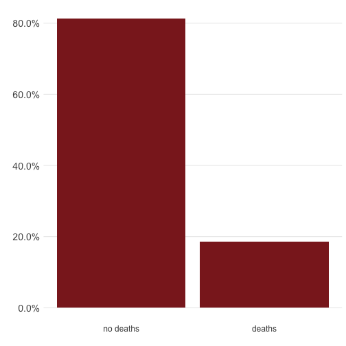

If the goal is inferential, there are ways to correct for this problem, primarily by weighting the likelihood function to minimize bias in the estimates. If that is not done, the model might be capturing well the oversampled category and ignoring the remaining category with the consequent implications.   


### Algorithm II: logistic regression (the predictive lane)

Perhaps we have a different goal, and we need to be able to predict when will we observe deaths among organized crime. To do that, we need to find the information (set of "features") that are more predictive. So we repeat our methodic explorations.


#### Best Subset Selection


```r
newdata1 <- AllData[, names(AllData) %in% c("organized_crime_wounded", "afi", "army",
                "navy", "federal_police", "long_guns_seized", "small_arms_seized",
                "clips_seized", "cartridge_sezied")]
newdata1 <- cbind(newdata1, organized_crime_death = AllData$organized_crime_death)
lg_subset <- bestglm(newdata1, family = binomial, IC = 'AIC',
                     method = 'exhaustive', TopModels = 10)
```

```
## Morgan-Tatar search since family is non-gaussian.
```

```r
lg_subset$BestModels  #Top 10 models with low AIC
```

```
##    organized_crime_wounded long_guns_seized small_arms_seized
## 1                     TRUE             TRUE             FALSE
## 2                     TRUE             TRUE             FALSE
## 3                     TRUE             TRUE             FALSE
## 4                     TRUE             TRUE              TRUE
## 5                     TRUE             TRUE             FALSE
## 6                     TRUE             TRUE             FALSE
## 7                     TRUE             TRUE             FALSE
## 8                     TRUE             TRUE              TRUE
## 9                     TRUE             TRUE              TRUE
## 10                    TRUE             TRUE             FALSE
##    cartridge_sezied clips_seized   afi army federal_police navy Criterion
## 1              TRUE        FALSE FALSE TRUE          FALSE TRUE  4733.905
## 2              TRUE         TRUE FALSE TRUE          FALSE TRUE  4734.877
## 3              TRUE        FALSE  TRUE TRUE          FALSE TRUE  4734.888
## 4              TRUE        FALSE FALSE TRUE          FALSE TRUE  4735.629
## 5              TRUE        FALSE FALSE TRUE           TRUE TRUE  4735.638
## 6              TRUE         TRUE  TRUE TRUE          FALSE TRUE  4735.824
## 7              TRUE         TRUE FALSE TRUE           TRUE TRUE  4736.595
## 8              TRUE        FALSE  TRUE TRUE          FALSE TRUE  4736.605
## 9              TRUE         TRUE FALSE TRUE          FALSE TRUE  4736.607
## 10             TRUE        FALSE  TRUE TRUE           TRUE TRUE  4736.659
```


```r
barplot(lg_subset$BestModels[,'Criterion'], names.arg=sapply(1:10, toOrdinal), xlab = "model ranks", ylab = "AIC", ylim = c(4733, 4737), xpd = FALSE, main = "AIC of suggested models")
```

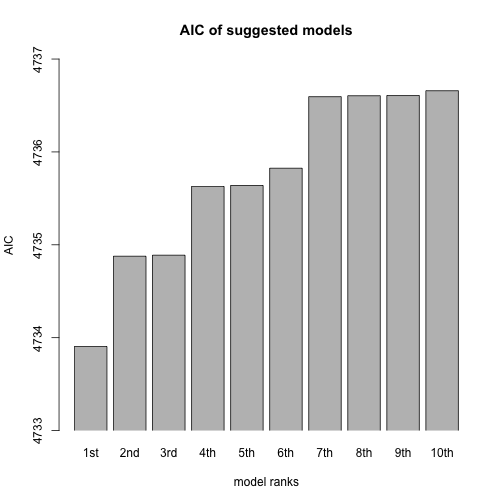

```r
lg_subset$BestModel
```

```
##
## Call:  glm(formula = y ~ ., family = family, data = Xi, weights = weights)
##
## Coefficients:
##             (Intercept)  organized_crime_wounded         long_guns_seized  
##              -2.1465619                0.2831332                0.1479253  
##        cartridge_sezied                     army                     navy  
##              -0.0002407                0.7477216                0.9415283  
##
## Degrees of Freedom: 5395 Total (i.e. Null);  5390 Residual
## Null Deviance:	    5185
## Residual Deviance: 4724 	AIC: 4736
```


```r
lg_subset_bic <- bestglm(newdata1, family = binomial, IC = 'BIC',
                         method = 'exhaustive', TopModels = 10)
```

```
## Morgan-Tatar search since family is non-gaussian.
```

```r
lg_subset_bic$BestModels  #Top 10 models with low BIC
```

```
##    organized_crime_wounded long_guns_seized small_arms_seized
## 1                     TRUE             TRUE             FALSE
## 2                     TRUE             TRUE             FALSE
## 3                     TRUE             TRUE             FALSE
## 4                     TRUE             TRUE              TRUE
## 5                     TRUE             TRUE             FALSE
## 6                     TRUE             TRUE             FALSE
## 7                     TRUE             TRUE             FALSE
## 8                     TRUE             TRUE             FALSE
## 9                     TRUE             TRUE              TRUE
## 10                    TRUE             TRUE              TRUE
##    cartridge_sezied clips_seized   afi army federal_police  navy Criterion
## 1              TRUE        FALSE FALSE TRUE          FALSE  TRUE  4766.873
## 2              TRUE         TRUE FALSE TRUE          FALSE  TRUE  4774.437
## 3              TRUE        FALSE  TRUE TRUE          FALSE  TRUE  4774.448
## 4              TRUE        FALSE FALSE TRUE          FALSE  TRUE  4775.189
## 5              TRUE        FALSE FALSE TRUE           TRUE  TRUE  4775.199
## 6              TRUE         TRUE  TRUE TRUE          FALSE  TRUE  4781.978
## 7              TRUE        FALSE FALSE TRUE          FALSE FALSE  4782.653
## 8              TRUE         TRUE FALSE TRUE           TRUE  TRUE  4782.749
## 9              TRUE        FALSE  TRUE TRUE          FALSE  TRUE  4782.759
## 10             TRUE         TRUE FALSE TRUE          FALSE  TRUE  4782.761
```


```r
barplot(lg_subset_bic$BestModels[,'Criterion'],
        names.arg=sapply(1:10, toOrdinal),
        xlab = "model ranks", ylab = "BIC", ylim = c(4766, 4783),
        xpd = FALSE, main = "BIC of suggested models")
```


```r
lg_subset_bic$BestModel
```

```
##
## Call:  glm(formula = y ~ ., family = family, data = Xi, weights = weights)
##
## Coefficients:
##             (Intercept)  organized_crime_wounded         long_guns_seized  
##              -2.1465619                0.2831332                0.1479253  
##        cartridge_sezied                     army                     navy  
##              -0.0002407                0.7477216                0.9415283  
##
## Degrees of Freedom: 5395 Total (i.e. Null);  5390 Residual
## Null Deviance:	    5185
## Residual Deviance: 4724 	AIC: 4736
```

Both AIC and BIC suggested the same 5-variable model.

* 5-variable model

```
organized_crime_dead ~ organized_crime_wounded +
                       army + navy +
                       long_guns_seized + cartridge_sezied
```

#### Forward and Backward selection


```r
# forward selection
lg_subset_fwd = bestglm(newdata1, family = binomial,
                        IC = 'AIC', method = 'forward', TopModels = 10)
```

```
## Morgan-Tatar search since family is non-gaussian.
```

```r
summary(lg_subset_fwd$BestModel)
```

```
##
## Call:
## glm(formula = y ~ ., family = family, data = Xi, weights = weights)
##
## Deviance Residuals:
##     Min       1Q   Median       3Q      Max  
## -4.5359  -0.6643  -0.4702  -0.4702   2.7220  
##
## Coefficients:
##                           Estimate Std. Error z value Pr(>|z|)    
## (Intercept)             -2.147e+00  5.598e-02 -38.344  < 2e-16 ***
## organized_crime_wounded  2.831e-01  3.748e-02   7.553 4.24e-14 ***
## long_guns_seized         1.479e-01  1.290e-02  11.465  < 2e-16 ***
## cartridge_sezied        -2.407e-04  5.083e-05  -4.736 2.18e-06 ***
## army                     7.477e-01  7.854e-02   9.521  < 2e-16 ***
## navy                     9.415e-01  1.816e-01   5.184 2.18e-07 ***
## ---
## Signif. codes:  0 '***' 0.001 '**' 0.01 '*' 0.05 '.' 0.1 ' ' 1
##
## (Dispersion parameter for binomial family taken to be 1)
##
##     Null deviance: 5185.2  on 5395  degrees of freedom
## Residual deviance: 4723.9  on 5390  degrees of freedom
## AIC: 4735.9
##
## Number of Fisher Scoring iterations: 4
```


```r
# backward selection
lg_subset_bcw = bestglm(newdata1, family = binomial,
                        IC = 'AIC', method = 'backward', TopModels = 10)
```

```
## Morgan-Tatar search since family is non-gaussian.
```

```r
summary(lg_subset_bcw $BestModel)
```

```
##
## Call:
## glm(formula = y ~ ., family = family, data = Xi, weights = weights)
##
## Deviance Residuals:
##     Min       1Q   Median       3Q      Max  
## -4.5359  -0.6643  -0.4702  -0.4702   2.7220  
##
## Coefficients:
##                           Estimate Std. Error z value Pr(>|z|)    
## (Intercept)             -2.147e+00  5.598e-02 -38.344  < 2e-16 ***
## organized_crime_wounded  2.831e-01  3.748e-02   7.553 4.24e-14 ***
## long_guns_seized         1.479e-01  1.290e-02  11.465  < 2e-16 ***
## cartridge_sezied        -2.407e-04  5.083e-05  -4.736 2.18e-06 ***
## army                     7.477e-01  7.854e-02   9.521  < 2e-16 ***
## navy                     9.415e-01  1.816e-01   5.184 2.18e-07 ***
## ---
## Signif. codes:  0 '***' 0.001 '**' 0.01 '*' 0.05 '.' 0.1 ' ' 1
##
## (Dispersion parameter for binomial family taken to be 1)
##
##     Null deviance: 5185.2  on 5395  degrees of freedom
## Residual deviance: 4723.9  on 5390  degrees of freedom
## AIC: 4735.9
##
## Number of Fisher Scoring iterations: 4
```

Forward and backward selection both agreed on 5 variable model that we obtained from best subset selection alghoritm.

#### Cross validation approach on Best subset selection


```r
set.seed(4837)
lg_subset_cv= bestglm(newdata1, family = binomial,
                      IC = 'CV', CVArgs=list(Method="HTF", K=10, REP=1),
                         method = 'exhaustive')
```

```
## Morgan-Tatar search since family is non-gaussian.
```

```r
summary(lg_subset_cv$BestModel)
```

```
##
## Call:
## glm(formula = y ~ ., family = family, data = data.frame(Xy[,
##     c(bestset[-1], FALSE), drop = FALSE], y = y))
##
## Deviance Residuals:
##    Min      1Q  Median      3Q     Max  
## -5.339  -0.690  -0.514  -0.514   2.044  
##
## Coefficients:
##                   Estimate Std. Error z value Pr(>|z|)    
## (Intercept)      -1.957360   0.050712 -38.598   <2e-16 ***
## long_guns_seized  0.108097   0.009482  11.400   <2e-16 ***
## army              0.643469   0.076039   8.462   <2e-16 ***
## ---
## Signif. codes:  0 '***' 0.001 '**' 0.01 '*' 0.05 '.' 0.1 ' ' 1
##
## (Dispersion parameter for binomial family taken to be 1)
##
##     Null deviance: 5185.2  on 5395  degrees of freedom
## Residual deviance: 4859.9  on 5393  degrees of freedom
## AIC: 4865.9
##
## Number of Fisher Scoring iterations: 4
```


```r
cv_err <- lg_subset_cv$Subsets[,"CV"]
sdCV<- lg_subset_cv$Subsets[,"sdCV"]
k <- 0:(length(cv_err)-1)

data <- as.data.frame(cbind(k, cv_err, sdCV))

ggplot(data, aes(x=k, y=cv_err)) +
  geom_errorbar(aes(ymin=cv_err-sdCV, ymax=cv_err+sdCV), width=.1, col="blue") +
  geom_line() +
  geom_point()+
  labs(title= "Model selection with 10-fold cross-validation and 1-sd rule",
       x="Subset Size", y= "CV_error")+
  scale_x_discrete(limits=c(0:9))+
  geom_vline(xintercept = oneSDRule(data[,c("cv_err", "sdCV")])-1,
             col="red", linetype="dotted", size=1)
```

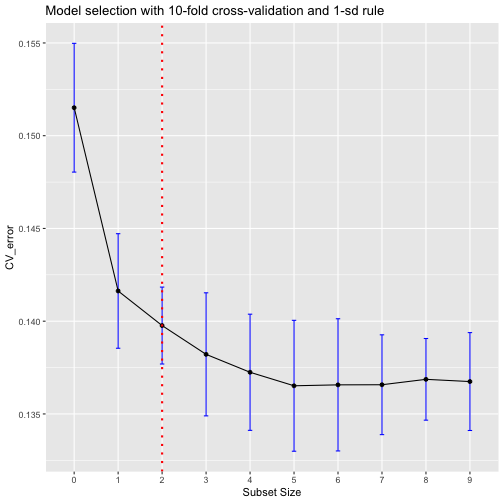

10-fold cross validation approach suggested the model:
```
organized_crime_dead = organized_crime_wounded + army + long_guns_seized
```
